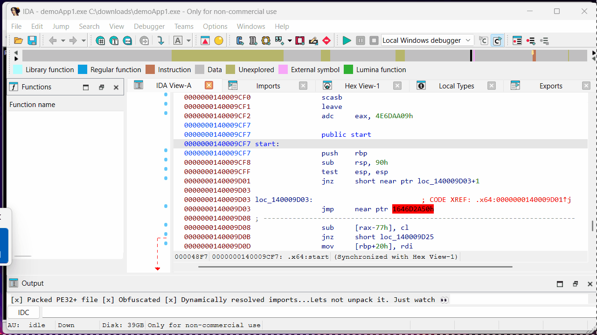

# Remora Hook

Win64 API monitor that hooks a target process using Export Address Table (EAT) and Import Address Table (IAT) patching -- no code modification on API bodies, no debugger attachment. Works with both normally compiled executables and heavily obfuscated, packed binaries with multiple unpacking layers, so you get a useful API log without fighting the protector first.



## Features

- **Three-tier hooking** -- bootstrap via LdrLoadDll inline patch, IAT patching for imports, EAT patching for dynamic resolution
- **60+ monitored APIs** -- file, process, memory, registry, network, HTTP, and crypto operations
- **Jail system** -- per-hook Allow/Log/Block/Ask policy with pattern-based rules
- **Colored log output** -- Rich Edit control with per-category coloring and file logging
- **Built-in tools** -- disassembler with symbol resolution, memory viewer, string scanner, auto memory dump

## Build

**Requirements:** Windows 10/11 x64, Visual Studio 2022 or later

Open `RemoraHook.sln` in Visual Studio 2022 and build the x64 Debug or Release configuration. Output goes to `bin\Debug\` or `bin\Release\`. Or run `build.bat` from the repo root for a command-line debug build.

> **Note:** If Windows Defender flags the hook DLL or injection, add the project folder as an exclusion.

## Usage

```
remora_hook.exe <target.exe> [args...]
```

Or drag and drop an executable onto the Remora window.

## This software uses

- [Zydis](https://github.com/zyantific/zydis) -- Fast x86/x86-64 disassembler library (MIT License)

## License

MIT
